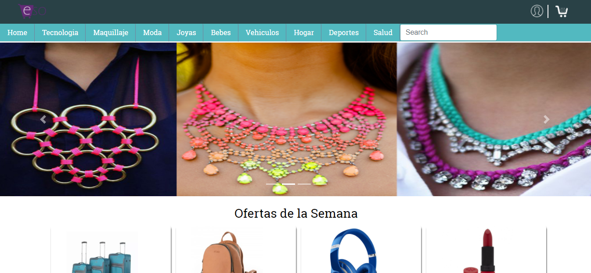
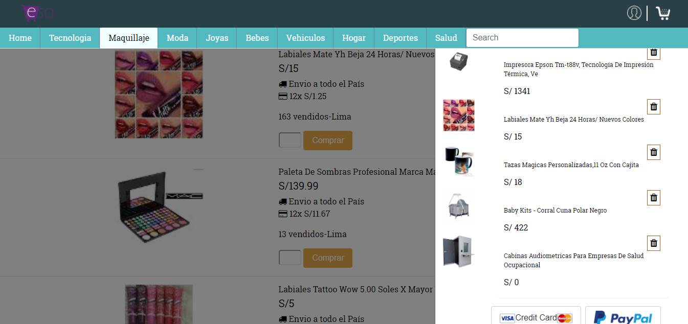

# E-commerce

* **Track:** _Especialización Front-end_
* **Curso:** _CONSTRUYE UNA SINGLE PAGE APP (SPA) MULTI-USUARIO CONSUMIENDO DATA REMOTA_
* **Unidad:** _Producto final_
* [PRUEBA E-commerce](https://marinarh.github.io/ecommerse-product-final/public/)

***

Creamos una app e-commerce, bajo los principios de SPA (Single page aplication),consiste en una página donde encontraras diferentes accesorios que estan categorizados en diferentes secciones como : TECNOLOGIA,MAQUILLAJE,MODA,JOYAS,ACCESORIOS DE BEBE,ACCSESORIOS DE AUTO,HOGAR ,SALUD Y DEPORTES.

## FLUJO

- Se realiza la inicializacion del servidor ,utilizando **node.js**.

- Empezamos creando la estructura principal,que consiste en una sola vista **home**.

- Utilizando la **api mercadolibre** ,mostramos los diferentes productos de cada categoria,(50 prod x categoria).

- Mediante esta Api obtenemos datos como: Precio, descripcion, Precios x cuotas,cuantos productos ya fueron vendidos,   cantidad de productos a comprar y un boton que indica Comprar.

- Al momento de seleccionar el producto,cada uno de ellos de se ira agregando en un **carrito** de la api **Paypal**.

- A traves del modal podras visualizar los productos que selecciones con su **precio*cantidad** ,que a su vez se iran   sumando a los otros productos.

- Cuentas con opcion de **eliminar** productos que seleccionaste.

- Con los productos seleccionados y la suma total de tus productos,tienes la opcion de **pagar** que te direcciona a    la cuenta de **Paypal** para que realices el pago.

## RECURSOS

* Html,css,Javascript,
* Node,
* Express (dependencia),
* gitignore,
* Api Mercadolibre,
* Api Paypal.

## DEMO

## Integrantes(GitHub)

* [LAURA JIMENEZ](https://github.com/LauraJH16)
* [MARINA RODRIGUEZ](https://github.com/MarinaRH)
